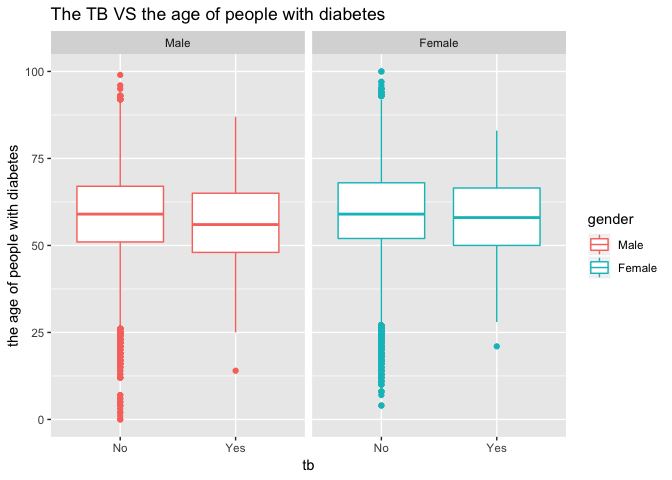

Final\_virsion \_annie
================
Annie Yu (xy2404)
11/15/2018

``` r
load("dm.Rdata")

df_combine = dm_base %>% 
  rename(
    subject_id = JiBenCID,
    glu_average = fastglu, 
    weight_initial = tizhong_1st, 
    weight_average = tizhong, 
    height = ShenGao, 
    glu_initial = kfxt_1st,
    gender = xingbie,
    district = GuanLiQX,
    sys_pressure = Sbp,
    dia_pressure = Dbp,
    exercise_time = xiuxiansj,
    exercise = xiuxiantl,
    drug_insulin = insulin,
    drug_oral_sulfo = sulfonylurea,
    drug_oral_biguanide = biguanide,
    drug_oral_glu = glu_inhib,
    retina = reti, 
    skin = derm, 
    vessel = vesl, 
    nerve = neur,
    kidney = neph, 
    depression = depress,
    dmtime = quezhensj,
    birthyear  = birth_year,
    birthmon = birth_mon,
    dmdatayear = rucu_year,
    dmdatamon = rucu_mon,
    dmdataage = rucuage,
    drug_order = fuyaoqk) %>% 
  mutate(
    gender = factor(gender, labels = c("Male", "Female")),
    district = as.factor(district),
    glu_self_monitor = as.factor(celiangxtgl),
    bmi_initial = weight_initial/(height/100)^2, 
    bmi_average = weight_average/(height/100)^2, 
    bmi_change = bmi_average - bmi_initial,
    glu_change = glu_average - glu_initial,
    tb = as.factor(ifelse(censer == 1, "No", "Yes")),
    exercise = as.factor(exercise),
    drug_oral_name  = case_when(drug_oral_sulfo == "1" & drug_oral_biguanide == "0" & drug_oral_glu == "0" ~"sulfonylurea",
                           drug_oral_biguanide == "1" & drug_oral_sulfo == "0" & drug_oral_glu == "0" ~ "biguanide",
                           drug_oral_glu == "1" & drug_oral_biguanide == "0" & drug_oral_sulfo == "0" ~ "glu_inhib",
                           drug_oral_sulfo == "1" & drug_oral_biguanide == "1" & drug_oral_glu == "0" ~"sulfonylurea&biguanide",
                           drug_oral_biguanide == "1" & drug_oral_sulfo == "0" & drug_oral_glu == "1" ~ "biguanide&glu_inhib",
                           drug_oral_sulfo == "1" & drug_oral_biguanide == "0" & drug_oral_glu == "1" ~"sulfonylurea&glu_inhib",
                           drug_oral_sulfo == "1" & drug_oral_biguanide == "1" & drug_oral_glu == "1" ~"sulfonylurea&glu_inhib&biguanide",
                           TRUE ~ "NA"),
    drug = drug_oral_biguanide + drug_oral_biguanide + drug_oral_glu + drug_insulin,
    retina = as.numeric(retina),
    skin = as.numeric(skin),
    vessel = as.numeric(vessel),
    nerve = as.numeric(nerve),
    kidney = as.numeric(kidney),
    complications = retina + skin + vessel + nerve + kidney + depression,
    complications = as.factor(complications),
    drug_order = as.factor(drug_order)
  )


levels(df_combine$exercise) <- list('1' = 1,  '2' = 2, '3' = c(3,4))

levels(df_combine$district) <- list("Huangpu" = 310101, "Xuhui" = 310104, "Changning" = 310105, "Jingan" = 310106, "Putuo" = 310107, "Zhabei" = 310108, "Hongkou" = 310109, "Yangpu" = 310110, "Minhang" = 310112, "Baoshan" = 310113,  "Pudong" = c(310115, 10119), "Jiading" = 310114, "Jinshan" = 310116, "Songjiang" = 310117, "Qingpu" = 310118, "Fengxian" = 310120, "Chongming" = 310230)

levels(df_combine$glu_self_monitor) <- list("Yes" = 1, "No" = 2:3)
```

Incidence of tb...
------------------

``` r
model.poisson <- glm(censer ~ days, family=poisson, data=df_combine)
summary(model.poisson)
```

    ## 
    ## Call:
    ## glm(formula = censer ~ days, family = poisson, data = df_combine)
    ## 
    ## Deviance Residuals: 
    ##      Min        1Q    Median        3Q       Max  
    ## -1.41710   0.00250   0.00428   0.00738   0.00974  
    ## 
    ## Coefficients:
    ##               Estimate Std. Error z value Pr(>|z|)  
    ## (Intercept) -9.757e-03  4.784e-03  -2.040   0.0414 *
    ## days         3.660e-06  2.933e-06   1.248   0.2120  
    ## ---
    ## Signif. codes:  0 '***' 0.001 '**' 0.01 '*' 0.05 '.' 0.1 ' ' 1
    ## 
    ## (Dispersion parameter for poisson family taken to be 1)
    ## 
    ##     Null deviance: 1566.4  on 170398  degrees of freedom
    ## Residual deviance: 1564.8  on 170397  degrees of freedom
    ## AIC: 340797
    ## 
    ## Number of Fisher Scoring iterations: 4

``` r
exp(coef(model.poisson))
```

    ## (Intercept)        days 
    ##   0.9902906   1.0000037

``` r
exp(confint(model.poisson))
```

    ## Waiting for profiling to be done...

    ##                 2.5 %    97.5 %
    ## (Intercept) 0.9810404 0.9996108
    ## days        0.9999979 1.0000094

Compare diabete and age...
--------------------------

Make a diabete-age distribution plot

``` r
plot_dia_d<-df_combine %>% 
  mutate(dmage = as.numeric(dmage),
         gender = as.factor(gender)) %>% 
  ggplot(aes(x = dmage, fill= gender)) +
  geom_density()+
  facet_grid(.~gender)+
  labs(
    x = "gender",
    y = "density of the age of people with diabetes"
  )+
  ggtitle('The age of people with diabetes(Male VS Female)')
  

plot_dia_v<-df_combine %>% 
  mutate(dmage = as.numeric(dmage),
         gender = as.factor(gender)) %>% 
  ggplot(aes(x = gender, y= dmage, fill=gender)) +
  geom_boxplot()+
  labs(
    x = "gender",
    y = "the age of people with diabetes"
  )+
  ggtitle('The age of people with diabetes(Male VS Female)')

plot_dia_d+plot_dia_v
```


Make a tb-diabete age distribution plot

``` r
df_combine %>% 
  mutate(dmage = as.numeric(dmage),
         tb = as.factor(tb),
         gender = as.factor(gender)) %>% 
  ggplot(aes( x=dmage,y=tb,group=gender) )+ 
  scale_fill_brewer(palette = "Spectral") + 
  geom_col(aes(fill=gender))+
  labs(
    x = "the age of people with diabetes",
    y = "tb"
  )+
  ggtitle('TB VS The age of people with diabetes')
```


``` r
df_combine %>% 
  mutate(dmage = as.numeric(dmage),
         gender = as.factor(gender)) %>% 
ggplot(aes(x = tb, y = dmage, color = gender)) +
  geom_boxplot()+
  facet_grid(.~gender)+
  labs(
    x = "tb",
    y = "the age of people with diabetes"
  )+
  ggtitle('The TB VS the age of people with diabetes')
```



Want to explore whether there is an association for TB with gender, the diabete time and birthyear
==================================================================================================

``` r
time_df <-df_combine %>% 
  na.omit(`_COL19`) %>% 
  rename(tbtime = `_COL19`) %>% 
  select(tbtime, tb, gender, dmage, birthyear) %>% 
  mutate(gender = as.numeric(gender),
         birthyear = as.numeric(birthyear), 
         dmage = as.numeric(dmage),
         tb = as.numeric(tb),
         tbtime = as.numeric(tbtime))

model_time <- lm(tb ~ gender + dmage + birthyear,data = time_df, family = binomial())
```

    ## Warning: In lm.fit(x, y, offset = offset, singular.ok = singular.ok, ...) :
    ##  extra argument 'family' will be disregarded

``` r
summary(model_time)
```

    ## 
    ## Call:
    ## lm(formula = tb ~ gender + dmage + birthyear, data = time_df, 
    ##     family = binomial())
    ## 
    ## Residuals:
    ##       Min        1Q    Median        3Q       Max 
    ## -4.10e-16 -2.91e-16 -2.25e-16 -8.20e-17  1.49e-13 
    ## 
    ## Coefficients:
    ##               Estimate Std. Error   t value Pr(>|t|)    
    ## (Intercept)  2.000e+00  6.231e-14  3.21e+13   <2e-16 ***
    ## gender      -2.661e-16  4.363e-16 -6.10e-01    0.542    
    ## dmage       -1.007e-18  3.150e-17 -3.20e-02    0.974    
    ## birthyear   -5.836e-18  3.126e-17 -1.87e-01    0.852    
    ## ---
    ## Signif. codes:  0 '***' 0.001 '**' 0.01 '*' 0.05 '.' 0.1 ' ' 1
    ## 
    ## Residual standard error: 5.338e-15 on 781 degrees of freedom
    ## Multiple R-squared:  0.5003, Adjusted R-squared:  0.4984 
    ## F-statistic: 260.6 on 3 and 781 DF,  p-value: < 2.2e-16

``` r
model_time %>% 
  broom::tidy() %>% 
  mutate(OR = exp(estimate),
         log_OR = estimate,
         OR_lower = exp(estimate - std.error*1.96),
         OR_upper = exp(estimate + std.error*1.96)) %>% 
  select(c(term, log_OR, OR, p.value, OR_lower, OR_upper)) %>% 
  knitr::kable()
```

| term        |  log\_OR|        OR|    p.value|  OR\_lower|  OR\_upper|
|:------------|--------:|---------:|----------:|----------:|----------:|
| (Intercept) |        2|  7.389056|  0.0000000|   7.389056|   7.389056|
| gender      |        0|  1.000000|  0.5420792|   1.000000|   1.000000|
| dmage       |        0|  1.000000|  0.9744966|   1.000000|   1.000000|
| birthyear   |        0|  1.000000|  0.8519468|   1.000000|   1.000000|
