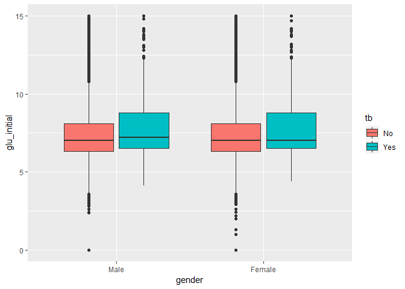
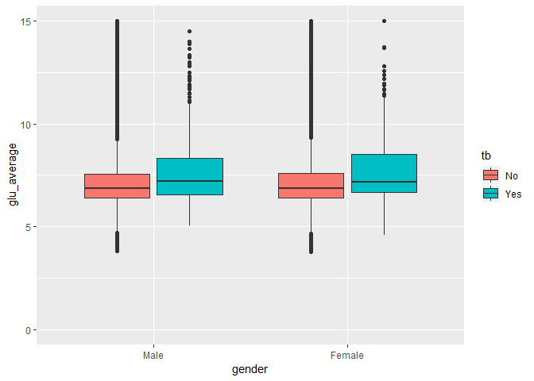
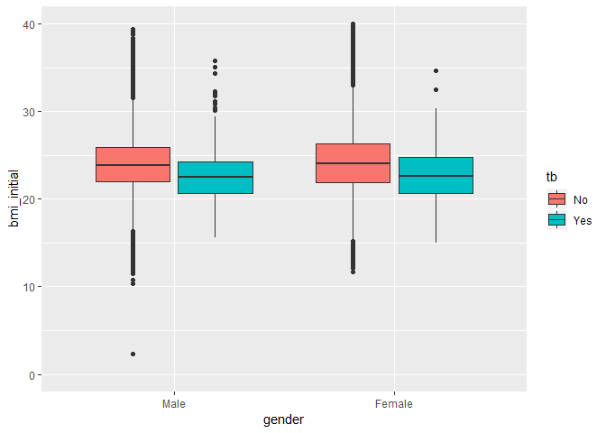
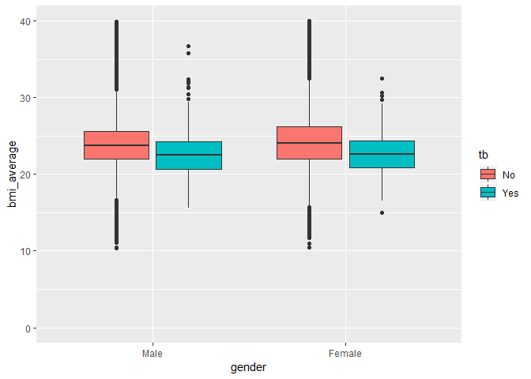
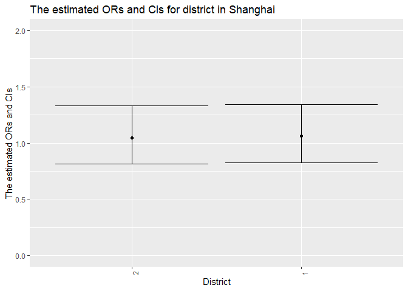
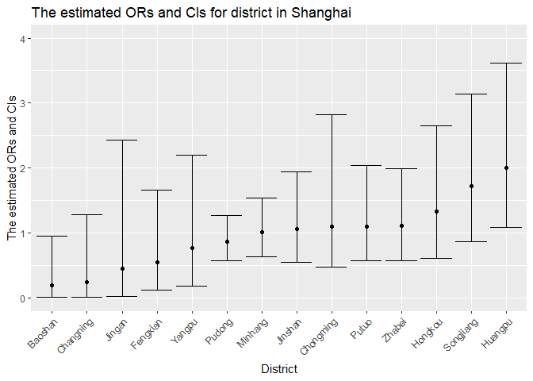

The Association Between Tuberculosis and glucose management, bmi and
district distribution in diabetes
================

### Explore the glucose and BMI distribution between male and female and tb status.

initial glucose distribution

<!-- -->

Since the range of initial glucose is quite large, we found median and
quartiles are a little higher in tb patients than in non-tb.

“average glucose” distribution

<!-- -->

We found median and quartiles are higher in tb patients than in non-tb.
Also the range of “average glucose” in follow-up periods for tb patients
is wider.

initial bmi distribution

<!-- -->

We found median and quartiles are higher in non-tb patients than in tb.

“average bmi” distribution

<!-- -->

We found median and quartiles of “average bmi” in follow-up periods are
higher in non-tb patients than in
tb.

### Explore whether diabetes who regularly monitor glucose can reduce the risk of having tb in urban or rural areas

<!-- -->

Obtain the estimate and confidence interval of the adjusted odds ratio
for having tb comparing diabetes who regularly monitor glucose to those
who don’t do keeping all other variables fixed in urban or rural
area.

### Explore whether diabetes who regularly monitor glucose can reduce the risk of having tb within different districts

<!-- -->

For each district in Shanghai, obtain the estimate and confidence
interval of the adjusted odds ratio for having tb comparing diabetes who
regularly monitor glucose to those who don’t monitor glucose regularly
keeping all other variables fixed.
