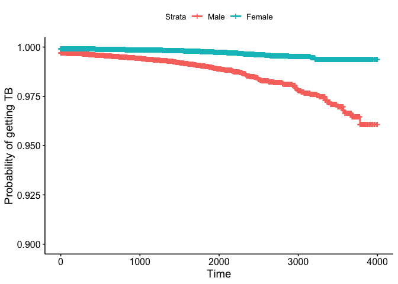

K-M plot
================
Rui Huang
November 24, 2018

``` r
load('./data/df_combine.RData')

df_combine$survival = with(df_combine, Surv(days, tb == "Yes"))

km <- survfit(survival ~ 1, data = df_combine, conf.type = "log-log")
km_by_gender <- survfit(survival ~ gender, data = df_combine, conf.type = "log-log")


ggsurvplot(km_by_gender, data = df_combine, risk.table = F, pval = T, ylab = "Probability of getting TB", ylim = c(0.9, 1.0), legend.labs = c("Male", "Female"))
```

    ## Warning: Removed 1 rows containing missing values (geom_text).

    ## Warning: Removed 1 rows containing missing values (geom_text).


