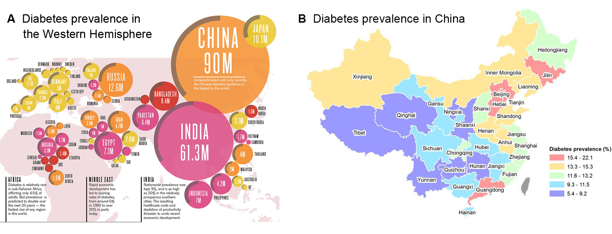

>###Introduction

Diabetes mellitus (DM) is one of the most urgent global challenges. It is a life-long disease that prevents your body from properly using the energy from the food you eat. People with diabetes are confering a higher risk for developing infections, such as mycobacterium tuberculosis (TB) infection. In China, TB is also one of the major public health problems as there were 1.56 million new TB cases and 51.52 thousand people death in 2015. 
 

<p style="text-align: center;">  </p>

The main planned question is that what’s the incident rate of TB among people with Type II Diabetes in Shanghai, China between 2004-2014. We also want to explore what potential risk factors would affect the incident rate. The potential factors include gender, the age at diagnosis of T2D, clinical parameters (BMI, fasting glucose), complications of T2D, choice of antidiabetic medication, mode of exercises and geographical location. Most of these factors were analyzed in our project. Hopefully, we could provide recommendations to control or decrease the prevalence of TB among people with Type II diabetes in China.


>###Data Sources

The diabetes data was from the Shanghai community-based diabetes management system (SCDMS). 

Tuberculosis data was from Shanghai Municipal TB Surveillance System (SMTSS). 

We obtained the administrative map from the [ArcGIS website](https://www.arcgis.com/home/item.html?id=105f92bd1fe54d428bea35eade65691b).


>###Statistical analyses
   
When we get our raw data, we first did the data wrangling and obtained the tidy data set. After the first glance of the raw data, we decided to mainly focus on four main risk factors: glucose level, drug usage level, complications level, and daily exercise level. When doing the analysis, for each risk factors, we build ggplot, shiny plots and maps to explore their distributions.We also analyzed the odds of tuberculosis in different levels of risk factors. We also did additional analysis, including Cox regression and Survival analysis.


>###Main Results

```{r, warning = F, message = F, echo=F}
library(tidyverse)
load('./data/df_combine.Rdata')

df_descrip = df_combine %>% 
  filter(district != "") %>% 
  mutate(tb = fct_recode(tb, '1'= 'Yes', '0'='No')) %>% 
  mutate(tb=as.character(tb),
         tb=as.numeric(tb)) 

# male incidence
df_male = df_descrip %>% filter(gender == 'Male')
male_incidence = sum(df_male$tb)/(sum(df_male$days)/365)

# female incidence
df_female = df_descrip %>% filter(gender == 'Female')
female_incidence = sum(df_female$tb)/(sum(df_female$days)/365)

```


Among males, the incident rate of TB was `r (100000*(sum(df_male$tb)/(sum(df_male$days)/365))) %>% round(3)` per 100 000 person-years while for female the incident rate is  `r (100000*(sum(df_female$tb)/(sum(df_female$days)/365))) %>% round(3)` per 100 000 person-years.
     
From Kaplan-Meier survival curves, we find out that genders, drug levels and exercises levels have significant effects on the probability of getting TB while complications have no significant effect. 

We fitted the Cox regression with covariates of complications, exercise, age, drug, and gender. The p-value for all three overall tests (likelihood, Wald, and score) are significant, indicating that the model is significant and all the factors matters in the model. 


>###Referrence

1.	Chen, L., Magliano, D. J., & Zimmet, P. Z. (2012). The worldwide epidemiology of type 2 diabetes mellitus--present and future perspectives. *Nature Reviews Endocrinology, 8*(4), 228-236. [doi:10.1038/nrendo.2011.183](https://doi.org/10.1038/nrendo.2011.183)

2.	Kumar, N. P., Moideen, K., George, P. J., Dolla, C., Kumaran, P., & Babu, S. (2016). Impaired cytokine but enhanced cytotoxic marker expression in mycobacterium tuberculosis-induced CD8+ T cells in individuals with type 2 diabetes and latent mycobacterium tuberculosis infection. *The Journal of Infectious Diseases, 213*(5), 866-870. [doi:10.1093/infdis/jiv484](https://doi.org/10.1093/infdis/jiv484)

3.	Webb, E. A., Hesseling, A. C., Schaaf, H. S., Gie, R. P., Lombard, C. J., Spitaels, A., . . . Beyers, N. (2009). High prevalence of Mycobacterium tuberculosis infection and disease in children and adolescents with type 1 diabetes mellitus. *The International Journal of Tuberculosis and Lung Disease, 13*(7), 868-874. Retrieved from https://www.ingentaconnect.com/contentone/iuatld/ijtld/2009/00000013/00000007/art00013


<p style="text-align: center;">  </p>