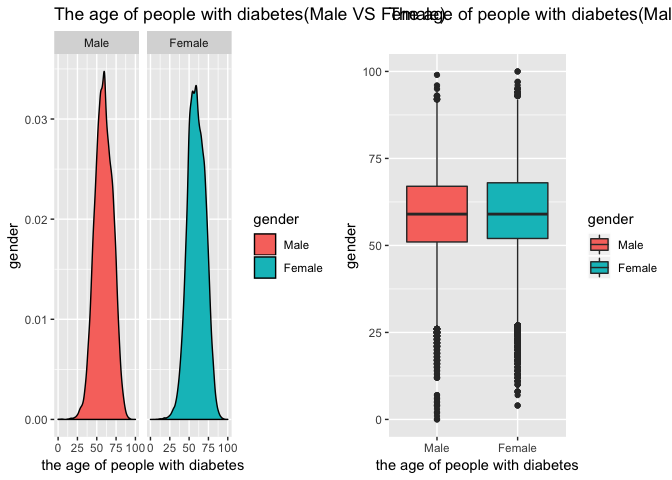
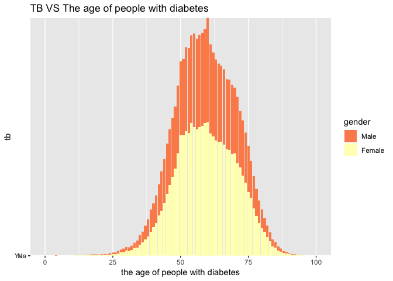
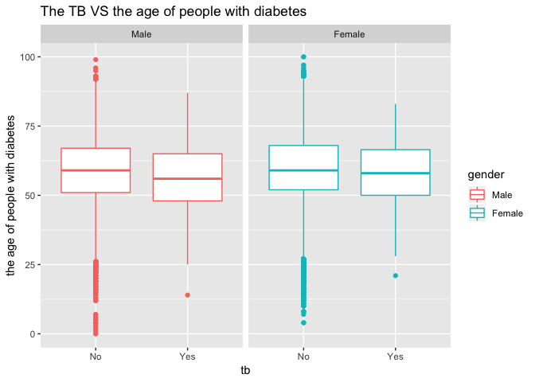

Combination
================
Annie Yu xy2404
12/3/2018

``` r
load("dm.Rdata")

df_combine = dm_base %>% 
  rename(
    subject_id = JiBenCID,
    glu_average = fastglu, 
    weight_initial = tizhong_1st, 
    weight_average = tizhong, 
    height = ShenGao, 
    glu_initial = kfxt_1st,
    gender = xingbie,
    district = GuanLiQX,
    sys_pressure = Sbp,
    dia_pressure = Dbp,
    exercise_time = xiuxiansj,
    exercise = xiuxiantl,
    drug_insulin = insulin,
    drug_oral_sulfo = sulfonylurea,
    drug_oral_biguanide = biguanide,
    drug_oral_glu = glu_inhib,
    retina = reti, 
    skin = derm, 
    vessel = vesl, 
    nerve = neur,
    kidney = neph, 
    depression = depress,
    dmtime = quezhensj,
    birthyear  = birth_year,
    birthmon = birth_mon,
    dmdatayear = rucu_year,
    dmdatamon = rucu_mon,
    dmdataage = rucuage,
    drug_order = fuyaoqk) %>% 
  mutate(
    gender = factor(gender, labels = c("Male", "Female")),
    district = as.factor(district),
    glu_self_monitor = as.factor(celiangxtgl),
    bmi_initial = weight_initial/(height/100)^2, 
    bmi_average = weight_average/(height/100)^2, 
    bmi_change = bmi_average - bmi_initial,
    glu_change = glu_average - glu_initial,
    tb = as.factor(ifelse(censer == 1, "No", "Yes")),
    exercise = as.factor(exercise),
    drug_oral_name  = case_when(drug_oral_sulfo == "1" & drug_oral_biguanide == "0" & drug_oral_glu == "0" ~"sulfonylurea",
                           drug_oral_biguanide == "1" & drug_oral_sulfo == "0" & drug_oral_glu == "0" ~ "biguanide",
                           drug_oral_glu == "1" & drug_oral_biguanide == "0" & drug_oral_sulfo == "0" ~ "glu_inhib",
                           drug_oral_sulfo == "1" & drug_oral_biguanide == "1" & drug_oral_glu == "0" ~"sulfonylurea&biguanide",
                           drug_oral_biguanide == "1" & drug_oral_sulfo == "0" & drug_oral_glu == "1" ~ "biguanide&glu_inhib",
                           drug_oral_sulfo == "1" & drug_oral_biguanide == "0" & drug_oral_glu == "1" ~"sulfonylurea&glu_inhib",
                           drug_oral_sulfo == "1" & drug_oral_biguanide == "1" & drug_oral_glu == "1" ~"sulfonylurea&glu_inhib&biguanide",
                           TRUE ~ "NA"),
    drug = drug_oral_biguanide + drug_oral_biguanide + drug_oral_glu + drug_insulin,
    retina = as.numeric(retina),
    skin = as.numeric(skin),
    vessel = as.numeric(vessel),
    nerve = as.numeric(nerve),
    kidney = as.numeric(kidney),
    complications = retina + skin + vessel + nerve + kidney + depression,
    complications = as.factor(complications),
    drug_order = as.factor(drug_order)
  )


levels(df_combine$exercise) <- list('1' = 1,  '2' = 2, '3' = c(3,4))

levels(df_combine$district) <- list("Huangpu" = 310101, "Xuhui" = 310104, "Changning" = 310105, "Jingan" = 310106, "Putuo" = 310107, "Zhabei" = 310108, "Hongkou" = 310109, "Yangpu" = 310110, "Minhang" = 310112, "Baoshan" = 310113,  "Pudong" = c(310115, 10119), "Jiading" = 310114, "Jinshan" = 310116, "Songjiang" = 310117, "Qingpu" = 310118, "Fengxian" = 310120, "Chongming" = 310230)

levels(df_combine$glu_self_monitor) <- list("Yes" = 1, "No" = 2:3)
```

Compare diabete and age...
--------------------------

Make a diabete-age distribution plot

``` r
plot_dia_d<-df_combine %>% 
  mutate(dmage = as.numeric(dmage),
         gender = as.factor(gender)) %>% 
  ggplot(aes(x = dmage, fill= gender)) +
  geom_density()+
  facet_grid(.~gender)+
  labs(
    x = "the age of people with diabetes",
    y = "gender"
  )+
  ggtitle('The age of people with diabetes(Male VS Female)')
  

plot_dia_v<-df_combine %>% 
  mutate(dmage = as.numeric(dmage),
         gender = as.factor(gender)) %>% 
  ggplot(aes(x = gender, y= dmage, fill=gender)) +
  geom_boxplot()+
  labs(
    x = "the age of people with diabetes",
    y = "gender"
  )+
  ggtitle('The age of people with diabetes(Male VS Female)')

plot_dia_d+plot_dia_v
```



Make a tb-diabete age distribution plot

``` r
df_combine %>% 
  mutate(dmage = as.numeric(dmage),
         tb = as.factor(tb),
         gender = as.factor(gender)) %>% 
  ggplot(aes( x=dmage,y=tb,group=gender) )+ 
  scale_fill_brewer(palette = "Spectral") + 
  geom_col(aes(fill=gender))+
  labs(
    x = "the age of people with diabetes",
    y = "tb"
  )+
  ggtitle('TB VS The age of people with diabetes')
```



``` r
df_combine %>% 
  mutate(dmage = as.numeric(dmage),
         gender = as.factor(gender)) %>% 
ggplot(aes(x = tb, y = dmage, color = gender)) +
  geom_boxplot()+
  facet_grid(.~gender)+
  labs(
    x = "tb",
    y = "the age of people with diabetes"
  )+
  ggtitle('The TB VS the age of people with diabetes')
```



Want to explore whether there is an association for TB with gender, the diabete time and birthyear
==================================================================================================

``` r
time_df <-df_combine %>% 
  na.omit(`_COL19`) %>% 
  rename(tbtime = `_COL19`) %>% 
  select(tbtime, tb, gender, dmage, birthyear) %>% 
  mutate(gender = as.numeric(gender),
         birthyear = as.numeric(birthyear), 
         dmage = as.numeric(dmage),
         tb = as.numeric(tb),
         tbtime = as.numeric(tbtime))

model_time <- lm(tb ~ gender + dmage,data = time_df, family = binomial())
```

    ## Warning: In lm.fit(x, y, offset = offset, singular.ok = singular.ok, ...) :
    ##  extra argument 'family' will be disregarded

``` r
summary(model_time)
```

    ## 
    ## Call:
    ## lm(formula = tb ~ gender + dmage, data = time_df, family = binomial())
    ## 
    ## Residuals:
    ##       Min        1Q    Median        3Q       Max 
    ## -3.78e-16 -2.75e-16 -2.35e-16 -7.60e-17  1.49e-13 
    ## 
    ## Coefficients:
    ##               Estimate Std. Error    t value Pr(>|t|)    
    ## (Intercept)  2.000e+00  1.092e-15  1.831e+15   <2e-16 ***
    ## gender      -2.620e-16  4.354e-16 -6.020e-01    0.548    
    ## dmage        3.959e-18  1.685e-17  2.350e-01    0.814    
    ## ---
    ## Signif. codes:  0 '***' 0.001 '**' 0.01 '*' 0.05 '.' 0.1 ' ' 1
    ## 
    ## Residual standard error: 5.335e-15 on 782 degrees of freedom
    ## Multiple R-squared:  0.5004, Adjusted R-squared:  0.4991 
    ## F-statistic: 391.6 on 2 and 782 DF,  p-value: < 2.2e-16
