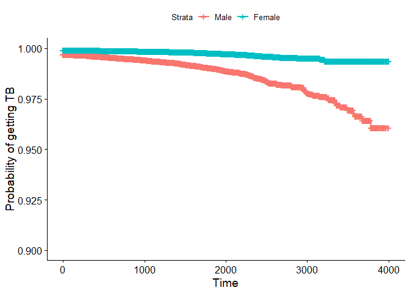

Cox Analysis and Visualization
================
DZ
November 25, 2018

### Multivariate Cox Regrassion and Interpretation

``` r
load('./data/df_combine.RData')

df <- df_combine %>% 
  mutate(age = 2018-as.numeric(birthyear)) %>% 
  mutate(complications = as.numeric(complications)) %>% 
  mutate(exercise = as.numeric(exercise))

cox <- coxph(Surv(days, censer) ~ complications+gender+exercise+age+drug, data =df)
```

#### The global test statistic is given by:

``` r
broom::glance(cox) %>%
  select(statistic.log,p.value.log,statistic.sc,p.value.sc,statistic.wald,p.value.wald,r.squared) %>% 
  knitr::kable(digits = 3)
```

| statistic.log | p.value.log | statistic.sc | p.value.sc | statistic.wald | p.value.wald | r.squared |
| ------------: | ----------: | -----------: | ---------: | -------------: | -----------: | --------: |
|      4901.174 |           0 |     4775.888 |          0 |        4769.39 |            0 |     0.028 |

#### The summary of Cox Regression

``` r
broom::tidy(cox) %>% 
  mutate(exp_estimate = exp(estimate)) %>% 
  select(term,exp_estimate, std.error, statistic, p.value) %>% 
knitr::kable(digits = 3)
```

| term          | exp\_estimate | std.error | statistic | p.value |
| :------------ | ------------: | --------: | --------: | ------: |
| complications |         0.821 |     0.005 |  \-37.852 |   0.000 |
| gender        |         0.919 |     0.005 |  \-17.172 |   0.000 |
| exercise      |         0.818 |     0.005 |  \-37.195 |   0.000 |
| age           |         0.999 |     0.000 |   \-2.226 |   0.026 |
| drug          |         0.909 |     0.002 |  \-40.007 |   0.000 |

The p-value for all three overall tests (likelihood, Wald, and score)
are significant, indicating that the model is significant. These tests
evaluate the omnibus null hypothesis that all of the \(\beta\) are 0,
and therefore the omnibus null hypothesis is soundly rejected.

In the multivariate Cox analysis, the all covariates remain significant
(p \< 0.05).

The p-value for exercise is less than 2e-16, with a hazard ratio HR =
exp(coef) = 0.818, indicating a relationship between the exercise status
and decreased risk of death. When holding the other covariates constant,
exercising more than 2 hour a week (exercise=3) reduces the hazard by
nearly 20%. We conclude that, exercising more than 2 hour a week is
associated with good prognostic.

The p-value for gender is less than 2e-16, with a hazard ratio HR =
exp(coef) = 0.919, indicating a relationship between the patients’ sex
and decreased risk of death. When holding the other covariates constant,
being female (sex=2) reduces the hazard by nearly 8%. We conclude that,
being female is associated with good prognostic.

The p-value for drug is less than 2e-16, with a hazard ratio HR =
exp(coef) = 0.909, indicating a relationship between the number of
andiabetic drugs that the patient takes and decreased risk of death.
When holding the other covariates constant, taking four antidiabetic
medications (drug=4) reduces the hazard by nearly 10%. We conclude that,
taking antidiabetic medication is associated with good prognostic.

### Visualizing the estimated distribution of survival times

``` r
df_combine$survival = with(df_combine, Surv(days, tb == "Yes"))

km <- survfit(survival ~ 1, data = df_combine, conf.type = "log-log")
km_by_gender <- survfit(survival ~ gender, data = df_combine, conf.type = "log-log")


ggsurvplot(km_by_gender, data = df_combine, risk.table = F, pval = T, ylab = "Probability of getting TB", ylim = c(0.9, 1.0), legend.labs = c("Male", "Female"))
```

    ## Warning: Removed 1 rows containing missing values (geom_text).
    
    ## Warning: Removed 1 rows containing missing values (geom_text).

<!-- -->
