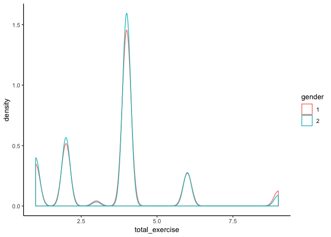
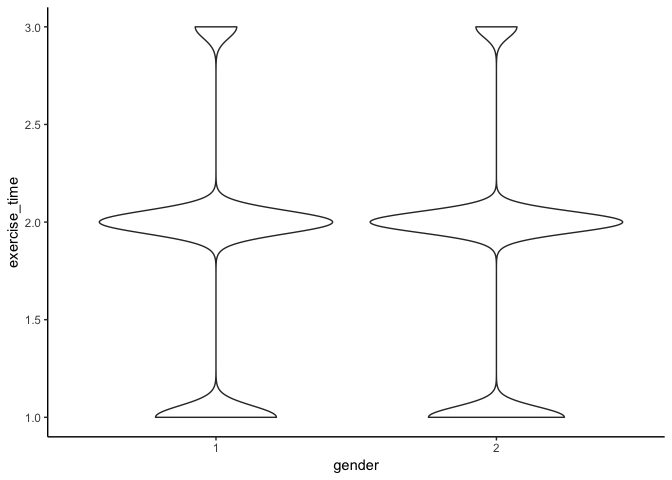
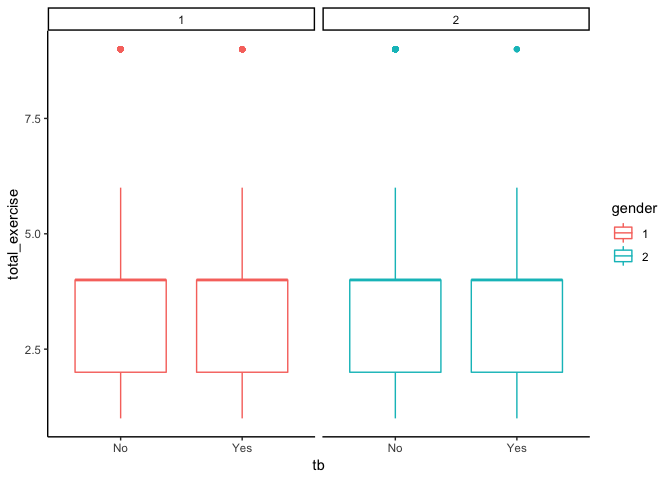

exercise
================
Rui Huang
November 14, 2018

### Cleaning data and rename variables

``` r
load('./dm.Rdata')
df_raw = dm_base %>%   
  rename(subject_id = JiBenCID,  
         weight = tizhong,  
         height = ShenGao,  
         exercise_time = xiuxiansj) %>%   
  mutate(gender = ifelse(xingbie == 1, "Male", "Female"),  
         tb = ifelse(censer == 1, "No", "Yes"),  
         exercise = as.factor(xiuxiantl)) %>%   
  select(-xingbie, -censer, -xiuxiantl) %>%   
  janitor::clean_names()  
  
levels(df_raw$exercise) <- list("Mild" = 1,  "Medium" = 2,'heavy'=c(3,4))
```

### Combine data

``` r
df_combine = dm_base %>% 
  rename(
    subject_id = JiBenCID,
    glu_average = fastglu, 
    weight_initial = tizhong_1st, 
    weight_average = tizhong, 
    height = ShenGao, 
    glu_initial = kfxt_1st,
    gender = xingbie,
    district = GuanLiQX,
    sys_pressure = Sbp,
    dia_pressure = Dbp,
    exercise_time = xiuxiansj,
    exercise = xiuxiantl,
    drug_insulin = insulin,
    drug_oral_sulfo = sulfonylurea,
    drug_oral_biguanide = biguanide,
    drug_oral_glu = glu_inhib,
    retina = reti, 
    skin = derm, 
    vessel = vesl, 
    nerve = neur,
    kidney = neph, 
    depression = depress,
    dmtime = quezhensj,
    birthyear  = birth_year,
    birthmon = birth_mon,
    dmdatayear = rucu_year,
    dmdatamon = rucu_mon,
    dmdataage = rucuage) %>% 
  mutate(
    bmi_initial = weight_initial/(height/100)^2, 
    bmi_average = weight_average/(height/100)^2, 
    bmi_change = bmi_average - bmi_initial,
    glu_change = glu_average - glu_initial,
    tb = ifelse(censer == 1, "No", "Yes"),
    exercise = as.factor(exercise),
    drug_oral = case_when(drug_oral_biguanide == 0 & drug_oral_biguanide == 0 &     drug_oral_glu == 0 ~0, TRUE ~ 1),
    drug = case_when(drug_oral == 0 & drug_insulin ==0 ~ 0,TRUE ~ 1),
    retina = as.numeric(retina),
    skin = as.numeric(skin),
    vessel = as.numeric(vessel),
    nerve = as.numeric(nerve),
    kidney = as.numeric(kidney),
    complications = retina + skin + vessel + nerve + kidney + depression,
    complications = as.factor(complications)
  )


levels(df_combine$complications) <- list(none=0,one=1,more_than_two=c(2,6))
levels(df_combine$exercise) <- list('1' = 1,  '2' = 2, '3' = c(3,4))
```

Compare male and female mean for exercise by t.test

``` r
male_exercise = df_combine %>% 
  filter(gender == 1) %>% 
  mutate(exercise = as.numeric(exercise))
    
female_exercise = df_combine %>% 
  filter(gender == 2) %>% 
  mutate(exercise = as.numeric(exercise))

var.test(male_exercise$exercise,female_exercise$exercise, alternative = "two.sided")
```

    ## 
    ##  F test to compare two variances
    ## 
    ## data:  male_exercise$exercise and female_exercise$exercise
    ## F = 1.1286, num df = 69985, denom df = 100410, p-value < 2.2e-16
    ## alternative hypothesis: true ratio of variances is not equal to 1
    ## 95 percent confidence interval:
    ##  1.113299 1.144108
    ## sample estimates:
    ## ratio of variances 
    ##           1.128589

``` r
t.test(male_exercise$exercise,female_exercise$exercise, var.equal=FALSE, paired=FALSE) 
```

    ## 
    ##  Welch Two Sample t-test
    ## 
    ## data:  male_exercise$exercise and female_exercise$exercise
    ## t = 15.613, df = 144660, p-value < 2.2e-16
    ## alternative hypothesis: true difference in means is not equal to 0
    ## 95 percent confidence interval:
    ##  0.03253039 0.04187009
    ## sample estimates:
    ## mean of x mean of y 
    ##  1.950747  1.913547

Compare male and female mean for exercise\_time by t.test

``` r
var.test(male_exercise$exercise_time,female_exercise$exercise_time, alternative = "two.sided")
```

    ## 
    ##  F test to compare two variances
    ## 
    ## data:  male_exercise$exercise_time and female_exercise$exercise_time
    ## F = 1.0195, num df = 69985, denom df = 100410, p-value = 0.005619
    ## alternative hypothesis: true ratio of variances is not equal to 1
    ## 95 percent confidence interval:
    ##  1.005646 1.033476
    ## sample estimates:
    ## ratio of variances 
    ##           1.019458

``` r
t.test(male_exercise$exercise_time,female_exercise$exercise_time, var.equal=FALSE, paired=FALSE) 
```

    ## 
    ##  Welch Two Sample t-test
    ## 
    ## data:  male_exercise$exercise_time and female_exercise$exercise_time
    ## t = 6.8304, df = 149640, p-value = 8.503e-12
    ## alternative hypothesis: true difference in means is not equal to 0
    ## 95 percent confidence interval:
    ##  0.01453694 0.02623712
    ## sample estimates:
    ## mean of x mean of y 
    ##  1.799360  1.778973

Compare male and female mean for exercise\_time\*exercise by t.test

``` r
male_exercise = male_exercise %>% mutate(total_exercise = exercise * exercise_time)
female_exercise = female_exercise %>% mutate(total_exercise = exercise * exercise_time)
var.test(male_exercise$total_exercise,female_exercise$total_exercise, alternative = "two.sided")
```

    ## 
    ##  F test to compare two variances
    ## 
    ## data:  male_exercise$total_exercise and female_exercise$total_exercise
    ## F = 1.1381, num df = 69985, denom df = 100410, p-value < 2.2e-16
    ## alternative hypothesis: true ratio of variances is not equal to 1
    ## 95 percent confidence interval:
    ##  1.122712 1.153782
    ## sample estimates:
    ## ratio of variances 
    ##           1.138131

``` r
t.test(male_exercise$total_exercise,female_exercise$total_exercise, var.equal=FALSE, paired=FALSE) 
```

    ## 
    ##  Welch Two Sample t-test
    ## 
    ## data:  male_exercise$total_exercise and female_exercise$total_exercise
    ## t = 13.445, df = 144240, p-value < 2.2e-16
    ## alternative hypothesis: true difference in means is not equal to 0
    ## 95 percent confidence interval:
    ##  0.1001726 0.1343634
    ## sample estimates:
    ## mean of x mean of y 
    ##  3.655774  3.538506

Make exercise distribution plot

``` r
df_combine %>% 
  mutate(exercise = as.numeric(exercise),
         total_exercise = exercise * exercise_time,
         gender = as.factor(gender)) %>% 
  ggplot(aes(x = total_exercise, color = gender)) +
  geom_density()
```



``` r
df_combine %>% 
  mutate(exercise = as.numeric(exercise),
         total_exercise = exercise * exercise_time,
         gender = as.factor(gender)) %>% 
  ggplot(aes(x = gender, y = total_exercise, color = gender)) +
  geom_boxplot()
```


``` r
df_combine %>% 
  mutate(exercise = as.numeric(exercise),
         gender = as.factor(gender)) %>% 
  ggplot(aes( x = gender, y = exercise)) +
  geom_violin()
```


``` r
df_combine %>% 
  mutate(gender = as.factor(gender)) %>% 
  ggplot(aes( x = gender, y = exercise_time)) +
  geom_violin()
```



Make tb vs exercise plot

``` r
df_combine %>% 
  mutate(exercise = as.numeric(exercise),
         total_exercise = exercise * exercise_time,
         gender = as.factor(gender)) %>% 
  ggplot(aes(x = tb, y = total_exercise, color = gender)) +
  geom_boxplot() +
  facet_grid(.~gender)
```


