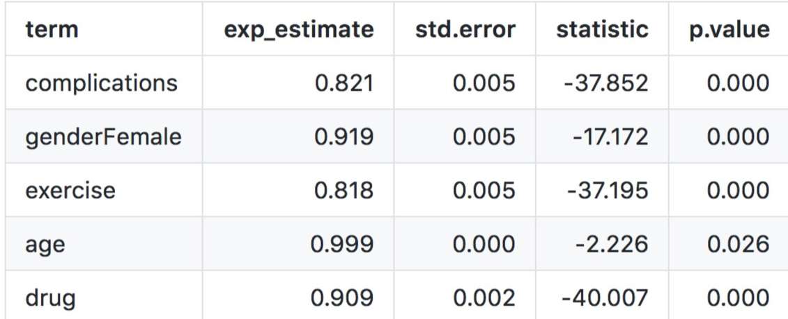
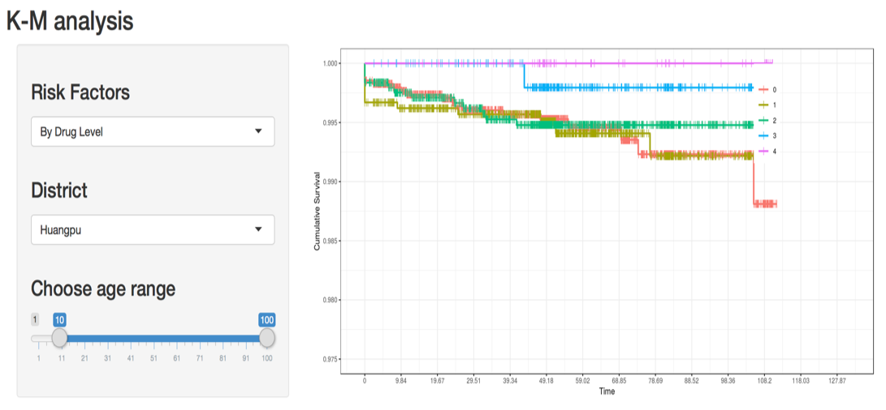

```{r,include=F}
require(rgdal)
require(tidyverse)
knitr::opts_chunk$set(
  fig.width = 6,
  fig.asp = .6,
  out.width = "80%"
)

library("htmltools")
library("vembedr")

```


### Why are we doing this? 

Due to rapid urbanizations and lifestyles, type 2 diabetes (T2D) has become one of the most concerning public health issues in China. People with T2D are at risk of multiple complications including blindness, cardiovascular diseases, and becoming more susceptible to infectious diseases. As a result, researchers began to notice a higher tuberculosis (TB) incidence in the T2D positive population. Therefore, we would like to explore the association between TB and T2D and what potential risk factors contribute to this comorbidity, and hopefully, provide recommendations to control or decrease the prevalence of T2D and TB in China.


### What Have we done?


After cleaning our database, we mainly focused on four main risk factors: diabetes diagnosis age, glucose management, drug usage level, complications level, and daily exercise level. When doing the analysis, for each risk factors, we looked for the different distributions of different levels by gender, by district, and by age. we also analyzed the odds of tuberculosis in different levels of risk factors. We have explored histograms, density plot and odds ratio comparing plot to analyze different distributions. Furthermore, we applied "shiny" to create interactive graphics and web-like applications and fitted an advanced statistical model "Cox Regression" and made survival analysis.


### What have we found? 



We estimated the incidence rate of TB within following-up period for different gender and found that male diabetes had a higher risk of TB. We also found the factors including the diagnosis age of diabetes, BMI, exercise, drug taking would also affact the risk of TB. Also, there was a clear separation of Kaplan–Meier survival
curves which showed that people does not taking medicines have a higher probability of being infected with .


### Screen Cast


```{r echo=FALSE}
embed_url("https://www.youtube.com/watch?v=pD03ZKy_cmM")
```


***

#### Relevant Links: 

[Data Source](https://drive.google.com/open?id=1GPXa4-lAR7s1kYu0m6uMAxWKNmOVekh-) | [Data Discription](VariableDictionary.html) | [Final Report](https://github.com/danazenggg/shiny/blob/master/Final_Report.md) | [Screen Cast](https://www.youtube.com/watch?v=pD03ZKy_cmM) 

#### Contact Us:
[Annie Yu](mailto:xy2404@cumc.columbia.edu) | [Coco Zou](mailto:xz2809@cumc.columbia.edu) | [Dana Zeng](mailto:dz2399@cumc.columbia.edu) | [Hanbo Qiu](mailto:hq2103@cumc.columbia.edu) | [Rui Huang](mailto:rh2916@cumc.columbia.edu) 

***

<p style="text-align: center;">  </p>