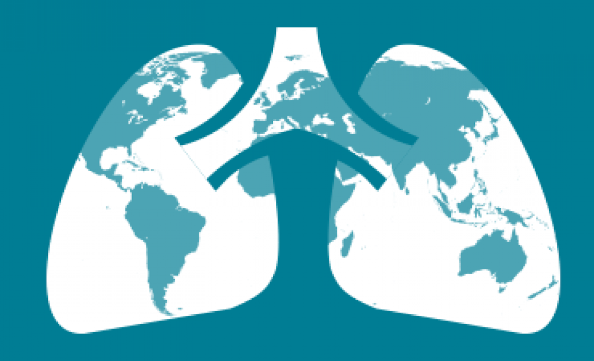

###Why are we doing this? 

Due to rapid urbanizations and lifestyles, type 2 diabetes (T2D) has become one of the most concerning public health issues in China. People with T2D are at risk of multiple complications including blindness, cardiovascular diseases, and becoming more susceptible to infectious diseases. As a result, researchers began to notice a higher tuberculosis (TB) incidence in the T2D positive population. Therefore, we would like to explore the association between TB and T2D and what potential risk factors contribute to this comorbidity, and hopefully, provide recommendations to control or decrease the prevalence of T2D and TB in China.

###What Have we done?

Someone write something here lol 

###What have we found? 

####Dana' map 
